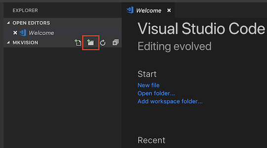
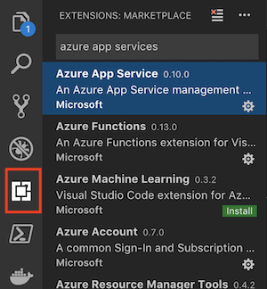

# Calling the Azure Computer Vision with Node.js

In the [previous session](https://github.com/DrazenDodik/mimmitkoodaa), we used HTML, JavaScript and Node.js to connect to an Events API published by the city of Helsinki.

Building on that knowledge we will now utilize inteligent APIs provided as part of Azure Cognitive Services to leverage external artificial intelligence in our application.


## Packages and APIs :package:
We've learned there are two simple ways to add complex functionalities to your applications without having to write everything yourself:
1. **External packages (npm)** - Packages are libraries of code that get pulled to your computer for execution. Packages rely on the performnce of your own environment to execute, but you have full control of their execution. 
1. **External services (APIs)** - APIs are functions exposed by other services providers. This means that you only make a call to an API, and the service provider executes some logic and provides usually a [JSON](https://developers.squarespace.com/what-is-json) based response.

In the previous session we used a simple query style API, which allows us to submit an query input (*="Search for events in Malmi"*) and returns an query result (*=JSON that contained information about events in Malmi*). The same concept applies to the APIs that provide much more complex functionalities, like for example computer vision.

## Artifical inteligence as an API :robot:

The simple way to add basic artificial inteligence to your applications is through services like [Cognitive Services](http://aka.ms/cognitive). These APIs include services like 
* **Computer Vision** - that will analyze the image contents and return you JSON data about the scene, activity, faces, text etc. :point_right: [Demo](https://azure.microsoft.com/en-us/services/cognitive-services/computer-vision/)
* **Speech** - to analyze and convert either text to speech, or speech to text. There are also more advanced scenarios like recognizing the same speaker across the audio file :point_right: [Demo](https://azure.microsoft.com/en-us/services/cognitive-services/speech-to-text/)
* **Translation** - Detect the langauge and translate text. You can also add custom translations for industry specific language
* **Emotion detection** - will analyze an image and give you data about the emotions it recognized and the related confidence level (how sure is the service about the emotion on a scale of 0-1) :point_right: [Demo](https://azure.microsoft.com/en-gb/services/cognitive-services/face/#detection)


### The basic principales of calling all of the services is the same :heavy_check_mark:
1. Collect the request data (image, text) from an input form (html page)
1. Submit the request data to an API (node.js back end code)
1. Receive an JSON response
1. Parse and display the response (result EJS page)


## Let's create our core app

Let's go ahead and create a simple node.js app with some static pages.
- Create a new directory on your desktop called **mkvision**
- Open VS Code, click on Open Folder and select the folder you just created

### Create your folder structure :fire:
- In VS Code file explorer click on the New Folder icon and create a new folder named **public** (this will contain all our public files)



- Use the same button to create another new folder named **routes** (this will contain the router js file)
- Create a new folder name **views** and another folder under it called **vision** (this will contain your vision search result)

*In case you created the folders inside each other, you can easily move them by dragging the folder out to the main level, so you have three folders all on the same level*

### Create your app :fire::fire:
Now let's create the files: start by adding an `app.js` file in your root folder.

```javascript
// lets require express, so we can use it here
var express = require('express');
// create a new instance of express
var app = express();
var path = require('path'); 

//pickup the port from the environment or use a local one
var port = process.env.PORT || 3000;


// require the body-parser so we can easily read data that is passed from our form
var bodyParser = require('body-parser');

// tell express to use bodyparser and JSON
app.use(bodyParser.urlencoded({extended: true}));
app.use(bodyParser.json());

// tell express to server our static files from the public folder
app.use(express.static('public'));
// tell express that we'll use ejs as our view engine
app.set('view engine', 'ejs');

// update the root request to send the index.html file back as our home page
app.get('/', function (req, res) {
  res.sendFile(path.join(__dirname,'public', 'index.html'));
});

// tell express that we will use port 3000 for this webserver
app.listen(port);
```

Next lets create the `index.html` file under our `public` folder, that will be served to the browser when the user navigates to your site.

```HTML
<!DOCTYPE html>

<html>
  <head>
    <title>Image Analysis Service</title>
  </head>
  <body>
    <h1>Submit image for detection</h1>
    <form method="post" action="/vision/post" enctype="multipart/form-data">
      <label for="searchText">Select an image</label>
      <input type="file" id="imageFile" name="imageFile"  />
      <button type="submit">Go</button>
    </form>
  </body>
</html>
```

Now lets test our app launches correctly by initializing npm, installing the required packages we have references above (express, body-parser, node-fetch and ejs)

Start by opening the terminal view (in the menu select *Terminal -> New Terminal*) and initialize npm with the package details by executing `npm init` in the terminal window.

Next through the terminal window install the packages we required in app.js

- Install the express web server: `npm install express --save`
- Install the body parser: `npm install body-parser --save`
- Install the node fetch: `npm install node-fetch --save`
- Install the node fetch: `npm install ejs --save`

Now run your app by running `node app.js` in the Terminal window and go to http://localhost:3000 to see your app.

## Add routing and the results page

Next we will create the `visionRouter.js` file under the routes folder. In this router we will take care of all the requests that go under the /vision/ path of our website.

So, for example when a new image link is posted through our form we will use the /vision/post to send the image to the Custom Vision service and show the results.

So in your `routes/visionRouter.js` file add

```javascript
// require express event
var express = require('express');

// create a new EventRouter from express
var VisionRouter = express.Router();

// require node-fetch so we can easily get the JSON from the Helsinki city APIs
var fetch = require('node-fetch');

// require formidable so that we can easily parse file input
var formidable = require('formidable');

// require fs to generate stream out of our file
var fs = require('fs');


VisionRouter.route('/post').post(function (req, res) {
  // get the file that was submitted to the form from the request body.
  // the name of the file submision on our form is imageFile

  var form = new formidable.IncomingForm();
  form.parse(req, function(err, fields, files) {
    let fileStream = fs.createReadStream(files.imageFile.path);
    uriBase = "https://westeurope.api.cognitive.microsoft.com/vision/v2.0/analyze?visualFeatures=Description,Tags&subscription-key=985a04bb1dae4bf7977afba340a4a995";
    
    fetch(uriBase, { method: 'POST', body: fileStream, headers: { 'Content-Type': 'application/octet-stream' } })
    .then(response => response.json())
    .then(imageData => { 
        res.render('vision/results', {tags: imageData.tags});
    })
    .catch(error => console.error(error)); // in case of error print it to our commandline
  });

});

// export this EventRoute when require this file
module.exports = VisionRouter;
```

Above we referenced a new npm package `formidable` to manage the form. Install the correct package by running `npm install formidable --save` in the Terminal.

Next update your `app.js` file to use the newly creater routed for all requests under /vision

````javascript
const EventRouter = require('./routes/visionRouter');
app.use('/vision', EventRouter);
````

In our `routes/visionRouter.js` we said that after we've gotten a response from the Computer Vision service, we should render the results on the `views/vision/results` page.

Lets create the `results.ejs` page under the `views/vision/` folder and add the following HTML-code.

```HTML
<!DOCTYPE html>
<html>
  <head>
    <title>Tag results </title>
  </head>
  <body>
    <h1>Results </h1>
    <table id="resultsTable">
      <thead>
        <td>Tag</td>
      </thead>
      <!--For as long as i is smaller than the number of items in the events collection loop through this. For each item then show name and short_description-->
      <% for(var i=0; i < tags.length; i++) { %>
        <tr>
          <td><%= tags[i].name %></td>
          <td><%= tags[i].confidence %></td>
        </tr>
      <% } %>
    </table>
  </body>
</html>
```

Now test that your app works by running the app in the terminal with `node app.js` and head to http://localhost:3000/

:tada:
:tada: It works!
:tada:
:tada:

## Deploying to Azure :cloud: :cloud: :cloud:
Now that your app is running locally, let's try to deploy it so that it is publically available. You can do this easliy directly from the VS Code by downloading Azure App Service Extension.

Remember when we talked about how awesome extensible editors are? Well now you get to install an extension! 

Select the **Extensions** tab from VS Code (on the far left side) and type to the search Azure App Services. Install the one that is published by Microsoft.



Once it has installed click on the "Reload to activate" button to restart VS Code.

### For the next step, you will need to setup your Azure account.
To redeem a promo code, visit microsoftazurepass.com and follow these [Azure Pass redemption instructions](https://www.microsoftazurepass.com/Home/HowTo). You will get an activation pass from our staff.

### Now deploy your app to the cloud :cloud: 

You should now see an Azure icon at the end of the icon list on the left. Click on the Icon and login with your Azure credentials.
1. Click on the Deploy to Web App icon :globe_with_meridians:
1. Select your subscription :key:
1. Select "+ Create New Web App" :heavy_plus_sign:
1. Enter a unique name for the service, eg. mkvisionYourName
1. Select Node.js 10.10 and wait for the app to be created
1. Select the web app that you just created as the target for your deployment
1. Confirm that you allow the deployment to install npm packages and confirm the environment as default for this project
1. wait for the deployment to complete and then try to access the site by clicking the "Browse Website" button
