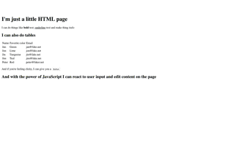

## Creating a search page
The list of languages keeps growing and the existing languages are constantly developed and updated. Everyone has their own opinion on what's the best language for what purpose, but in this excersise we will focus on HTML and JavaScript.

> :bulb: According to [StackOverflow Developer Study 2018](https://insights.stackoverflow.com/survey/2018/#most-popular-technologies), JavaScript is still the most popular technology amongst their survey respondands.

### In this excersice we will use

* **HTML** We'll use HTML to build the base for your website. The text, buttons, inputs and other elements.
  * The outcome will be working website but it won't have functionality and it won't have any styling.
* **CSS** will allow us to define the look and styling of our page by defining rules based on element types, names and classes.
  * All the buttons should be extra wide. Elements that are on the top of the page should have larger text. Everything that is a "quote" should have italic text and gray color.
* **JavaScript** will allow us to add more functionality to the page, update content and react to the users actions.
  * Use this for example to update the news on the site every 15 seconds or to change the background image when the user clicks at button.



As you learn more about software development, you'll notice that there are different languages: programming, scripting and markup languages. In addition, there are frameworks, engines and so much more.

When you start off, don't spend too much time worrying about what language to choose. JavaScript is a great way to get started, and to build a career with. It's powerful, runs in many different environments and it's very popular (=has a great community).

### Creating your page
In this excersise we will create a page that will list us events in Helsinki and allow us to search using keywords.

1. Open up your editor (VS Code) and create a new file.
2. Write the base for your html page (sample below)
3. Save the page on your computer in a new folder on your desktop called "HelsinkiEvents"
4. Open the file with your browser

```html
<!doctype html>

<html>
  <head>
    <title>Helsinki events</title>
  </head>

  <body>
    Hello world!
  </body>
</html>
```

Now there's not much there, so lets create a search box and a button on the page. We'll add a heading, define the html elements (input), give each element a type (text/button) and we'll give both inputs an ID, so we can easily find them in the future.

Replace our with the below:
```html
<h1>Find events in Helsinki</h1>

<input type="text" id="searchQuery" />
<input type="button" id="searchBtn" value="Search" />
```

Now if you open the page again in the browser, you should see the updated UI.

Unfortunately, our button doesn't really do anything, it doesn't search for events and doesn't really react to our click in any way. So lets see how we can react to the button click.

### Adding a JavaScript
Before we start searching for events, we need to get the value that the user wrote into the search box. So in the next step we will do the following:
1. Insert JavaScript to our page
1. Create a function
    * Woah woah, hold up there. What's a function? Well essentially it encapsulates a task, like "show a alert", in a single line of code. So instead of writing the same lines of code over and over again, every time you want to alert what the user wrote in their search box, you place this into a function and you can then call that function by it's name from different parts of your program (=reuse the same code).
1. Inside the function, tell JavaScript to get the show an alert with the value the user wrote in the search box on the page.
    * JavaScript is be able to access the HTML document and find elements by their name, ID, class and tag.
1. Tell our button to call our new function when it's clicked

*We don't necessarily need JavaScript to have the button do submit a form for example, but we'll use this as an opportunity to introduce JavaScript.*

Add this JavaScript code to your HTML-page after the button and before you close the body tag.
```javascript
<script>
  function sayHello() {
    alert(document.getElementById('searchQuery').value);
  }
</script>
```
And then update your button to call for that function when it's clicked
```html
<input type="button" id="searchBtn" value="Search" onclick="sayHello()" />
```

Now go to your browser and refresh the page. Write something into the search field and click the button.. and BOOM! You have alert popping up with the text! :boom:

>:bulb: If you right-click on the page and select "View Source" you'll see the all the code you wrote.
>
>This is because both HTML and JS are running now on the client-side and the browser interepts the code and renders it to objects and actions.
>
>Each browser has it's own way of interepting these but thanks to web standards, we have a common set of rules that all major browser follow. You'll see that by default buttons and alert boxes look slightly different in different web browser.

What if we want to check what the search query is, before we show the alert? To tell the user for example that searching for "Helsinki" doesn't really make sense in, when searching for events in Helsinki as all events contain the word "Helsinki".

* We will create a variable where we store the searchQuery
* Check if that search query is "Helsinki" and tell the user to search with something different if it's Helsinki.
* If the search query isn't that, we will show them what they searched for.

```javascript
<script>
  function sayHello() {
    var text = document.getElementById('searchQuery').value;

    if(text == "Helsinki") {
      alert("Hmm.. maybe you want to try a different search word for better results?");
    }
    else {
      alert("You searched for " + text);
    }
  }
</script>
```

And again, head to the browser, refresh your page and test that it works properly. 

You'll notice that the text comparison is case sensitive, so "helsinki" is not the same as "Helsinki".*

>:mag: Got some extra time? Use your favorite search engine to find away to ignore case sensitivity when comparing text in JavaScript.

At this point, take a breather and congratulate yourself.. and if you're the expressive type whaile your hands in the air :tada::tada::tada:

[Going to the backend with Node.js](https://github.com/DrazenDodik/mimmitkoodaa/blob/master/mimmitkoodaa-intro/part3_nodejs.md)

